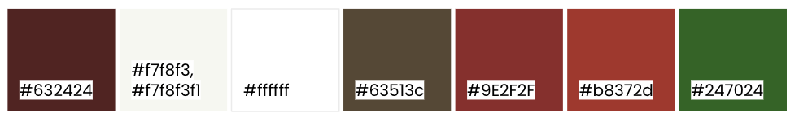

# Christmas Pantry

The Christmas Pantry invites its users to guess the ingredients for some of our most beloved holiday treats, hoping to entertain, challenge, and help users get into a festive mood.

The user is presented with a cake and tasked with picking out its ingredients from the pantry. The user will score points for picking the right ingredients, and lose points for picking the wrong ones. The aim is to get as high a score as possible.


The site can be accessed by this [link](https://johannacarolinep.github.io/christmas-pantry/)

---


## User Stories
### As a user landing on the website:
* I want to be able to quickly understand that this is a game and the type of the game so that I can quickly determine if this is of interest to me.

### As a user interested in playing the game:
* I want a brief, engaging and user-friendly introduction with upbeat language and clear instructions so that I can get started quickly and without the need for extensive reading.

* I want to be able to start the game easily with one click so that I can quickly engage with the game.

### As a player of the game:
* I want it to be clear what my task is, and what my options are so that I understand what is required to move forward in the game.

* I want the controls and interactive elements to be easy and intuitive to use so that the experience feels more enjoyable.

* I want to see my current score so that I can understand my performance.

* I want to be able to access the rules and instructions easily, without leaving the game, so that I can find answers if there is something that I don’t understand.

* I want the option to see more information/context for each question so that I can feel entertained, and to help jog my memory.

* I want to receive immediate feedback on whether my answer was correct or incorrect so that I can learn, as well as understand why my score went up or down.

* I want to see which level I am on so that I can understand how far into the game I have progressed, and be motivated to finish the game.

### As a player considering quitting the game:
* I want the ability to quit at any time, providing a sense of control over my game experience.

* I want to be able to change my mind, so that I can go back in case I regret my decision, or had clicked quit by accident.

### As a player quitting the game:
* I want to see my final score so that I can see how I performed.

* I want to have the option to restart the game, in case I want to try again.

## Features
### Welcome modal


The Welcome modal displays when the page has loaded, and the information inside the card is the first content meeting a visitor to the site. 

It contains:
- A heading welcoming the user and clarifying the purpose of the website.
- A short introduction to the game, and some brief instructions for how to play and how to navigate the website.
- A button ("Get started!"), which closes the modal, effectively starting the game.

### The main page


Closing the welcome modal, the user will see the main page, consisting of 4 main areas:

1. The header.
2. The question area.
3. The pantry area.
4. The footer.

### Header


The header is split into two rows. The first row contains a heading, the name of the game. The second row, the "stats area" has 3 components:

- The level: helps the user understand their progression through the game.

- The score: helps the user understand their performance in the game. The default value is 0. As the user moves through the game, the score will update when the user submits their selection, and be displayed as "points / possible points". After the first submission, the score would display "user points / 2", since the recipe on the first level contained 2 ingredients, and the max number of points was therefore 2. 

- A clickable icon: triggers the "Instructions modal" to display.

The position of the "stats area" in the header allows the user to easily access these three components at any time without the need to scroll. 

#### Instructions modal


The instructions modal is displayed when the user clicks on the icon in the header's "stats area".

It contains the game rules and instructions for how to play. To help the user stay "connected" to the game, the background for this modal is transparent. 

The user can close the modal by clicking on the "X" in the upper right corner, or by clicking anywhere in the window, outside of the modal's content card.

### Question area


This area makes up the question of the level. It contains:

- The name of the cake
- The origin of the cake (inside brackets, next to the name)
- The question. For each level, the task is the same, to pick out the cake's ingredients. To keep the user's interest, there are variations in how the question is worded.
- The number of ingredients the recipe contains, helping to set expectations.
- An image of the cake, providing a visual clue.
- A clickable icon to open the "cake-info-modal" (holding more information about the cake).

#### Cake info modal


The cake info modal opens when the user clicks the icon in the question area.

It contains a heading and a short text with more information about the cake at the current level. This text aims to entertain the player with interesting details about the cake in question. It can also act as a way to jog the user's memory about the cake, or in certain cases contain other hints about the recipe.

This modal has a transparent background. The user can close the modal by clicking on the "X" in the upper right corner or anywhere in the window outside of the modal's content card.

### Pantry area


The pantry area, clearly marked with its heading "The Pantry" contains four main components:

- The pantry (the ingredients the user can pick from).
- The selection counter.
- The "controls area".
- The "results area" (visible when the selection has been submitted).

#### Pantry


The pantry consists of a collection of clickable div elements, representing different ingredients. With the current setup, there are 12 ingredients for the user to choose from. In theory, this could change if more cake recipes were added to the JSON file since this is used to build the pantry.

The pantry is created for the first level and then remains the same throughout the game. This means the order of the ingredients stays the same for the length of the game, helping the player to get acquainted with their options. 

On devices with hover, the pantry ingredients will react when hovered.


##### Pantry selection


The player can click on any of the ingredients to select it. The ingredient will then change colour, indicating to the user that it has been selected. 

Clicking on an already selected ingredient will de-select it, and the colour will turn back.

##### Full pantry selection


For each level, the user can only select as many ingredients as the recipe contains. 

If the maximum amount of ingredients has been selected, the remaining ingredients will be "deactivated". They are styled as if faded out and are no longer clickable.

If the user de-selects an ingredient, the maximum is no longer reached, and the remaining ingredients are re-activated.

##### Pantry feedback after submission


After submission, the pantry will provide the player with some instant feedback. The ingredients the player got right will turn green, and get a checkmark icon. Incorrect ingredients turn red and get an "x" icon. Ingredients that should have been in the cake, but were not selected, will turn yellow and get a "dash" icon. 

None of the ingredients are clickable at this stage.

#### Selection counter


In the upper right corner of the pantry area is the selection counter. This feature helps the user keep track of their selection and clarifies to the user when the maximum number of ingredients have been picked.

When full, the selection counter will be highlighted by turning lighter and getting a soft box-shadow. 

#### Controls area


Below the pantry is the controls area, which holds the controls for the flow of the game:

- The "Next/Submit" button: Its text will alternate between "Submit" and "Next".
    - When its text is "Submit", it submits the player's selection. The score gets updated, and feedback is displayed, in the pantry and the results area. 
    - When its text is "Next", it moves the game to the next level and resets the pantry.

- "Quit": Will open a modal to confirm the player's intention to quit the game.

The "Next/Submit" button and the "Quit" button will be hidden after submission on the final level.


- "Finish": Displays after submission on the final level. Will open the quit modal, without the need to confirm with the user.

#### Results area


The results area appears underneath the controls, after submission on each level. 

It consists of a short text, providing additional feedback to the player, in written form. 

Its default is to show how many ingredients the player got correct, incorrect, and missed. 


If the player got all of the ingredients right, it adds a message to congratulate them.


If the player got all of the ingredients wrong, it adds a message to encourage the player.

#### Confirm quit modal

The confirm quit modal displays when the user clicks on the "Quit" button in the controls area.

It contains a simple question, asking the user to confirm if they want to quit the game. The user has two options, in the form of buttons:
- "Cancel", which will close the modal, and let the user return to the game. 
- "Confirm", which will close the modal, and instead open the "quit modal", effectively quitting the game for the user.

The player can also close the modal by clicking anywhere in the window, outside of the modal's content card.


### Quit modal

The quit modal opens when the player either clicks on "Confirm" in the "confirm quit" modal, or when the player clicks "Finish" in the "controls area" at the end of the game. 

This modal has a background that covers the main page, indicating to the user that they have now "moved away" from the game (in comparison to other modals with a transparent background).

The modal's content card: 
- has a heading that confirms to the player that the game is over.
- displays the player's final score, on the first row as their total amount of points, and on the second row in the context of the possible points they could have achieved.
- offers the player an option to restart the game.

### Footer


Finally, at the bottom of the main page is the footer, which holds contact information in the form of clickable icons linking to the creator's social media pages.

## Flowchart


## Technologies and tools used, split by primary usage area

### Planning
- [Balsamiq](https://balsamiq.com/) was used to make wireframes for the website.
- [Draw.io](https://app.diagrams.net/) was used to make a flowchart for the game.

### Code
- [HTML](https://developer.mozilla.org/en-US/docs/Web/HTML) was used as the foundation of the site.
- [CSS](https://developer.mozilla.org/en-US/docs/Web/css) was used to add the styles and layout of the site.
- [Javascript](https://developer.mozilla.org/en-US/docs/Web/JavaScript) was used for interactivity on the website.
- [JSON](https://developer.mozilla.org/en-US/docs/Web/JavaScript/Reference/Global_Objects/JSON) was used to store data.
- [VSCode](https://code.visualstudio.com/) was used as the IDE.

### Asset creation and editing
- [GIMP](https://www.gimp.org/) was used to edit and resize all images.
- [Favicon.io Favicon Generator](https://favicon.io/favicon-generator/) was used to make the favicon for the website
- [Adobe Firefly](https://www.adobe.com/se/sensei/generative-ai/firefly.html) was used to create images
- [Canva - Magic Media](https://www.canva.com/ai-image-generator/) was used to create images
- [Adobe Illustrator](https://www.adobe.com/se/products/illustrator.html) was used to create the favicon image and the default image

### Deployment and version control
- [Git](https://git-scm.com/) was used for the version control of the website.
- [GitHub](https://github.com/) was used to host the code of the website.

### Testing
- [Chrome Devtools](https://developer.chrome.com/docs/devtools/) was used for continuous testing and troubleshooting.
- [Lighthouse](https://developer.chrome.com/docs/devtools/lighthouse/) was used to evaluate and optimize the performance and accessibility of the website.
- [WAVE Tool](https://wave.webaim.org/) was used to test and troubleshoot accessibility on the website.
- [W3C Markup Validation Service](https://validator.w3.org/) was used to validate the HTML code of the website.
- [W3C CSS Validation Service](https://jigsaw.w3.org/css-validator/) was used to validate the CSS code of the website.

### Documentation
- [Am I Responsive?](https://ui.dev/amiresponsive) was used to create mockups of the website for the README.
- [Responsive Viewer](https://chrome.google.com/webstore/detail/responsive-viewer/inmopeiepgfljkpkidclfgbgbmfcennb/related?utm_source=ext_sidebar&hl=en-GB) was used to capture screenshots of the website across different device types.

## Design

### Color scheme
#### Primary colour scheme


The website uses a mainly warm colour scheme, incorporating the classic Christmas colours red and green, to help evoke a cosy and festive vibe, fitting the theme of the game.

##### Font colour:

A dark maroon (#632424) was chosen for the font, creating a warm and soft impression, while being rich and dark enough to ensure a strong contrast for high readability.

##### Neutral and light background colours:

Areas with substantial text/content use a neutral background — either a pale eggshell (#f7f8f3 or with slight transparency #f7f8f3f1) or pure white (#ffffff), minimizing distractions and helping the user to focus their attention. These light and neutral colours also help to provide a high contrast between the background and text.

##### Accent colours: 
The red (#9e2f2f and #b8372d)  and green (#247024) accent colours were chosen for their strong associations with Christmas, while the brown (#63513c) accent colour was chosen for being a warm and soft colour, allowing it to be used as an accent without the risk of drawing too much attention to an element, making it suitable for example as the background colour in the footer. 

#### Pantry selection/User feedback colour scheme


The brown colour (#63513c) is relatively neutral in symbolism, making it suitable to indicate selection in the pantry. It gives a clear visual cue to the user that the pantry item has been selected, without inferring a positive or negative connotation to the selection.

The broader associations of red and green colours are leveraged in the pantry feedback (green for correct, and red for incorrect). The additional colour, picked from outside of the primary colour scheme, was used for feedback on “missed” items. This choice was inspired by traffic lights, providing a clear visual cue for the user.

#### Additional colours
The website uses a variation of shadows and gradients, for which numerous additional colours have been used. Given the small extent of the usage for each of these colours, they should not be considered as part of the colour scheme.

### Typography

- Poppins Google Font was used as the main font throughout the website. The font was chosen for its high readability.


- Playpen Sans Google Font was used for the logo, headings, and buttons (including elements styled as buttons), to give the website a more playful, fun and personal look.


### Wireframes
- [Mobile](documentation/wireframes-mobile.pdf)
- [Tablet](documentation/wireframes-tablet.pdf)
- [Desktop](documentation/wireframes-desktop.pdf)

## Testing

All test-related documentation can be found in the [TESTING.md](TESTING.md) file.

## Deployment
### Deployment to GitHub Pages
The webpages are deployed to GitHub pages, using Git version control. The steps to deployment are as follows:
- In the GitHub repository, navigate to the Settings tab.
- From the source section drop-down menu, select the main branch, then click "Save".

Once a push is detected to the main branch GitHub will update the webpages with the new code in the main branch.

The live link can be found [here](https://johannacarolinep.github.io/christmas-pantry/).

If you wish to run the website locally you can clone it by typing the following command in your IDE Terminal:
- `git clone https://github.com/johannacarolinep/christmas-pantry.git`

Once on your local computer, you can open the index.html with a web browser.

## Future improvements
- Add a new feature that keeps track of the player's highest score across multiple games, incentivizing the player to do better than their best score. 

- Improve the accessibility of the game. Accessibility has been taken into consideration to some extent (factors such as colour contrast, not overly relying on colours to convey meaning, making sure the layout can handle it reasonably well when font size is enlarged through browser settings, and the use of aria-labels). However, there are still improvements needed, especially for the pantry selection and for the modals, to make this game accessible for users on screenreaders as well as users who cannot use a mouse.

- Redesign the pantry so that it allows for a good game experience if more advanced levels/recipes are added (meaning a greater number of options). Technically, more levels can be added by adding more objects (cakes) to the JSON file, but with the current layout, when the pantry ingredients become too numerous, it makes for a bad game experience, especially on smaller screen sizes.

- Create a leaderboard, where users can save their score using a username, possibly leveraging local storage. 

- Track when the level and current score change using local storage, and use this to preserve the session if the page is refreshed.

- Reuse the code to add more versions of the game. Add a main menu page from which the player would access the different versions of the game, and the option to reach the menu page from the quit modal in each game.


## Credits

### Code
#### Code for randomizing order of items in an array
I used [this code](https://stackoverflow.com/questions/2450954/how-to-randomize-shuffle-a-javascript-array) referred to as the Fisher-Yates Shuffle, in my function ```shuffle()```. Credit: User [coolaj86](https://stackoverflow.com/users/151312/coolaj86) on [Stack Overflow](https://stackoverflow.com/).

#### Code for scrolling to the top of the page
For my ```scrollTop()``` function in, I copied the last part of the code example on this W3 Schools page: [How TO - Scroll Back To Top Button](https://www.w3schools.com/howto/howto_js_scroll_to_top.asp).

#### Modals
I used the code on W3Schools' page [How TO - CSS/JS Modal](https://www.w3schools.com/howto/howto_css_modals.asp) as the basis for all of my modals in this project.

#### Box shadows
I used numerous box shadows on the website. In order to create these efficiently, I used a combination of two different tools:
- [Neumorphism.io](https://neumorphism.io/#e0e0e0)
- [UnusedCSS CSS Box Shadow Generator](https://unused-css.com/tools/box-shadow-generator)
 

### Media
#### Images

The below image was taken from [Pixabay](https://pixabay.com/)
- [Header background image](https://pixabay.com/illustrations/christmas-bauble-christmas-1079926/) (snowflakes.webp)

Images generated using [Adobe Firefly](https://www.adobe.com/products/firefly.html)
- Cake: Fudge (fudge.webp)
- Cake: Knäck (knack.webp)
- Cake: Candied almonds (candied-almonds.webp)
- Background, in modals and on the main page (wallpaper-gold.webp)

Images generated using [Canva Magic Media](https://www.canva.com/your-apps/generate_image/magic-media)
- Cake: Pavlova (pavlova.webp)
- Cake: Rocky Road (rockyroad.webp)
- Cake: Gingerbread cookies (gingerbread.webp)

Image created with [Adobe Illustrator](https://www.adobe.com/products/illustrator.html)
- The default image, which was also used in the favicon (default.webp).


#### Favicon
The favicon was created using [Favicon.io Favicon Generator](https://favicon.io/favicon-generator/).

#### Icons
All icons were taken from [Font Awesome](https://fontawesome.com/icons).

#### Fonts
Fonts were imported from [Google Fonts](https://fonts.google.com/).

## Acknowledgements
- I want to acknowledge my Code Institute mentor, [Iuliia Konovalova](https://github.com/IuliiaKonovalova), who always makes the most of our mentor sessions and shows up armed to the teeth with useful feedback and advice. 

- [Alexandru Sulea](https://github.com/Alexandru-S) - who has brought me countless cups of tea and encouraging words on late nights in the last few weeks.

---

