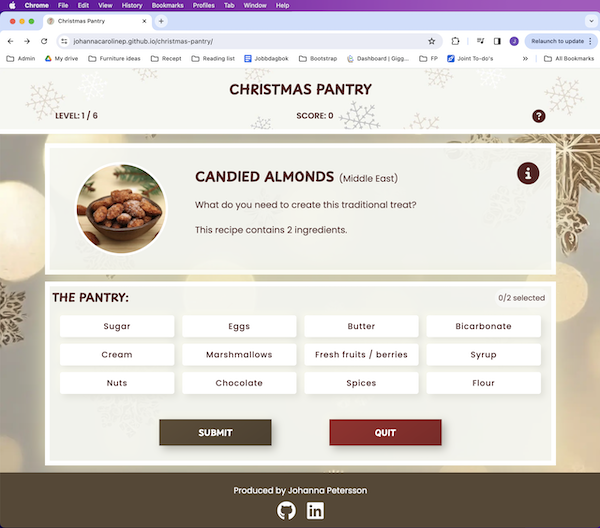
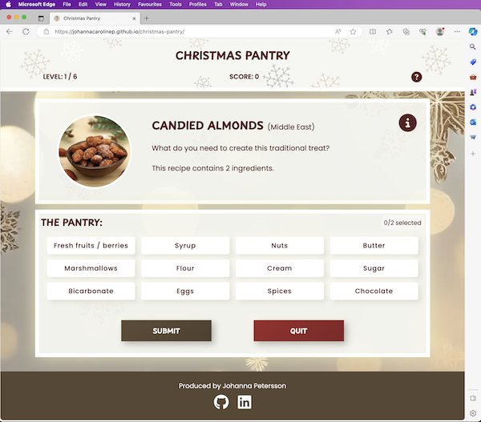
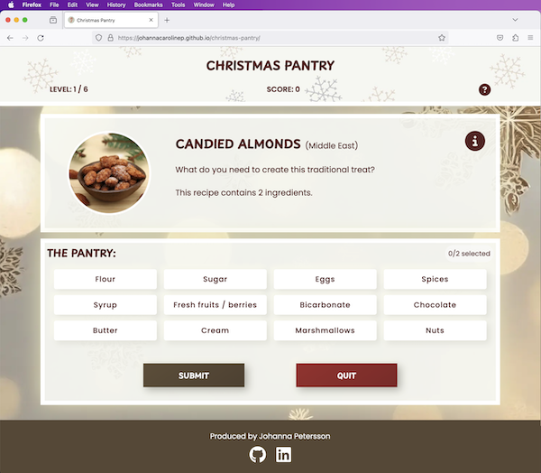
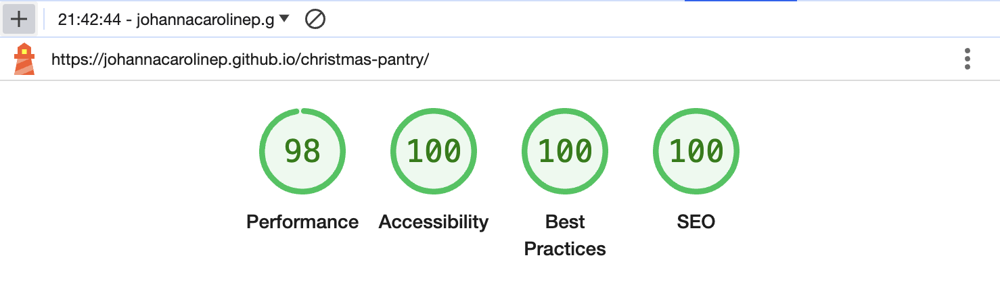

# Testing

## Browser Compatibility
To ensure cross-browser compatibility, the website was reviewed on Chrome, Safari, Microsoft Edge and Firefox.

### Screenshots of the website homepage opened on each browser:
- Chrome:

- Safari:

- Microsoft Edge:

- Firefox: 

## Responsiveness
The responsiveness was checked across numerous device sizes, with Google dev tools and with the Responsive Viewer extension.

The following screenshots were generated with the Responsive Viewer extension:

- [Welcome modal](documentation/responsive-welcome-modal.pdf)
- [The main page](documentation/responsive-main-page.pdf)
- [Various modals](documentation/responsive-modals.pdf)

## Manual testing of interactive elements
| area | feature | action | expected result | tested | passed | comments |
| --- | --- | --- | --- | --- | --- | --- |
| Welcome modal | | | | | | |
| Welcome modal | "Get started!" button | Click on "Get started!" | Closes the modal | Yes | Yes | - |
| Welcome modal | Modal background | Click in window outside content card | Does NOT close the modal | Yes | Yes | - |
| Header | Icon | Click on the questionmark icon | Opens the instructions modal | Yes | Yes | - |
| Instructions modal | "X" button | Click on "X" in upper right corner | Closes the instructions modal | Yes | Yes | - |
| Instructions modal | Window | Click on window, outside content card | Closes the instructions modal | Yes | Yes | - |
| Question area | Icon | Click ob the i-icon | Opens the cake-info modal | Yes | Yes | - |
| Cake-info modal | "X" button | Click on "X" in upper right corner | Closes the cake-info modal | Yes | Yes | - |
| Cake-info modal | Window | Click on window, outside content card | Closes the cake-info modal | Yes | Yes | - |
| Pantry | Ingredient | Click on active pantry ingredient | Selects the ingredient | Yes | Yes | - |
| Pantry | Ingredient | Click on selected pantry ingredient | De-selects the ingredient | Yes | Yes | - |
| Pantry | Ingredient | Click on deactivated ingredient (selection full) | Should not react | Yes | Yes | - |
| Pantry | Ingredient | Click on any ingredient after submitting | Should not react | Yes | Yes | - |
| Controls | "Submit" button | Click on "Submit" | Trigger user feedback (pantry feedback, results area, score update). Button changes to "Next". | Yes | Yes | *Triggers feedback regardless of selection, since selection is optional. |
| Controls | "Submit" button on final level | Click on "Submit" | Trigger feedback and score updates + Hide "Submit button" and "Quit" button. Display "Finish" button | Yes | Yes | - |
| Controls | "Next" button | Click on "Next" | Should move to next level, load in next question, activate all pantry items, hide results area. Button changes to "Submit" | Yes | Yes | - |
| Controls | "Quit" button | Click on "Quit" while in selection stage | Opens "Confirm quit" modal | Yes | Yes | - |
| Controls | "Quit" button | Click on "Quit" while in feedback/submitted stage | Opens "Confirm quit" modal | Yes | Yes | - |
| Controls | "Finish" button | Click on "Finish" button | Opens "Quit" modal | Yes | Yes | - |
| Confirm quit modal | "Cancel" button | Click on "Cancel" | Closes the "confirm quit" modal | Yes | Yes | - |
| Confirm quit modal | Window | Click on window, outside content card | Closes the "confirm quit" modal | Yes | Yes | - |
| Confirm quit modal | "Confirm" button | Click on "Confirm" | Closes the "confirm quit" modal and opens the "quit" modal | Yes | Yes | - |
| Quit modal | "Restart game" button | Click on "Restart game" | Closes the "quit" modal and resets the game | Yes | Yes | - |
| Quit modal | Modal background | Click in window outside content card | Does NOT close the modal | Yes | Yes | - |

## Lighthouse report
The website was tested with Lighthouse to ensure high performance and accessibility.

### Results on mobile:

### Results on desktop:

## Code validation
### HTML
### CSS
### Javascript

## Bugs
### Solved bugs
### Unsolved bugs

### Mistakes