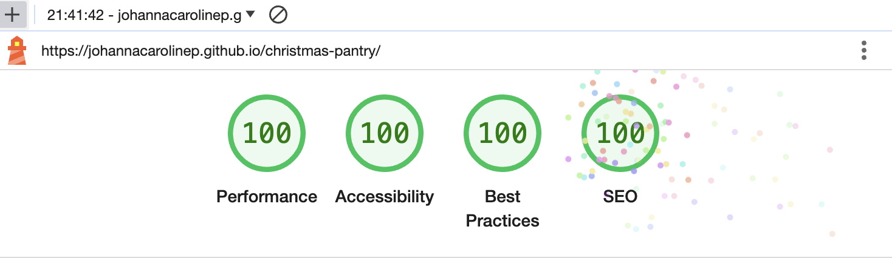
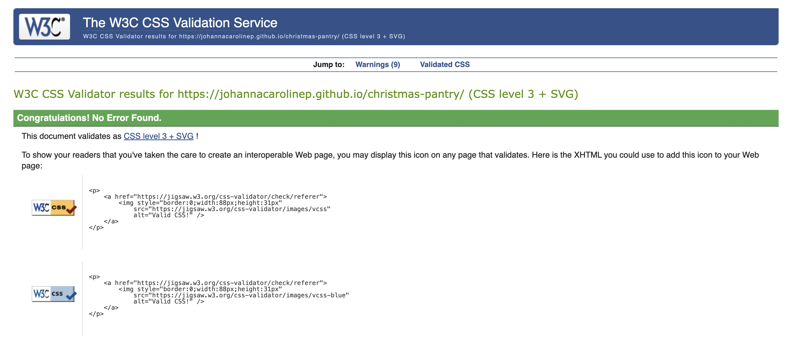
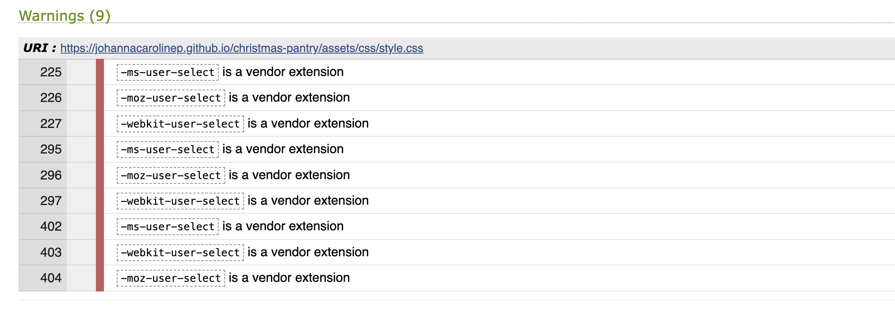

# Testing

## Browser Compatibility
To ensure cross-browser compatibility, the website was reviewed on Chrome, Safari, Microsoft Edge and Firefox.

### Screenshots of the website homepage opened on each browser:
- Chrome:


- Safari:


- Microsoft Edge:


- Firefox: 


## Responsiveness
The responsiveness was checked across numerous device sizes, with Google dev tools and with the Responsive Viewer extension.

The following screenshots were generated with the Responsive Viewer extension:

- [Welcome modal](documentation/responsive-welcome-modal.pdf)
- [The main page](documentation/responsive-main-page.pdf)
- [Various modals](documentation/responsive-modals.pdf)

## Manual testing of interactive elements
| area | feature | action | expected result | tested | passed | comments |
| --- | --- | --- | --- | --- | --- | --- |
| Welcome modal | | | | | | |
| Welcome modal | "Get started!" button | Click on "Get started!" | Closes the modal | Yes | Yes | - |
| Welcome modal | Modal background | Click in window outside content card | Does NOT close the modal | Yes | Yes | - |
| Header | Icon | Click on the questionmark icon | Opens the instructions modal | Yes | Yes | - |
| Instructions modal | "X" button | Click on "X" in upper right corner | Closes the instructions modal | Yes | Yes | - |
| Instructions modal | Window | Click on window, outside content card | Closes the instructions modal | Yes | Yes | - |
| Question area | Icon | Click ob the i-icon | Opens the cake-info modal | Yes | Yes | - |
| Cake-info modal | "X" button | Click on "X" in upper right corner | Closes the cake-info modal | Yes | Yes | - |
| Cake-info modal | Window | Click on window, outside content card | Closes the cake-info modal | Yes | Yes | - |
| Pantry | Ingredient | Click on active pantry ingredient | Selects the ingredient | Yes | Yes | - |
| Pantry | Ingredient | Click on selected pantry ingredient | De-selects the ingredient | Yes | Yes | - |
| Pantry | Ingredient | Click on deactivated ingredient (selection full) | Should not react | Yes | Yes | - |
| Pantry | Ingredient | Click on any ingredient after submitting | Should not react | Yes | Yes | - |
| Controls | "Submit" button | Click on "Submit" | Trigger user feedback (pantry feedback, results area, score update). Button changes to "Next". | Yes | Yes | *Triggers feedback regardless of selection, since selection is optional. |
| Controls | "Submit" button on final level | Click on "Submit" | Trigger feedback and score updates + Hide "Submit button" and "Quit" button. Display "Finish" button | Yes | Yes | - |
| Controls | "Next" button | Click on "Next" | Should move to next level, load in next question, activate all pantry items, hide results area. Button changes to "Submit" | Yes | Yes | - |
| Controls | "Quit" button | Click on "Quit" while in selection stage | Opens "Confirm quit" modal | Yes | Yes | - |
| Controls | "Quit" button | Click on "Quit" while in feedback/submitted stage | Opens "Confirm quit" modal | Yes | Yes | - |
| Controls | "Finish" button | Click on "Finish" button | Opens "Quit" modal | Yes | Yes | - |
| Confirm quit modal | "Cancel" button | Click on "Cancel" | Closes the "confirm quit" modal | Yes | Yes | - |
| Confirm quit modal | Window | Click on window, outside content card | Closes the "confirm quit" modal | Yes | Yes | - |
| Confirm quit modal | "Confirm" button | Click on "Confirm" | Closes the "confirm quit" modal and opens the "quit" modal | Yes | Yes | - |
| Quit modal | "Restart game" button | Click on "Restart game" | Closes the "quit" modal and resets the game | Yes | Yes | - |
| Quit modal | Modal background | Click in window outside content card | Does NOT close the modal | Yes | Yes | - |

## Lighthouse report
The website was tested with Lighthouse to ensure high performance and accessibility.

### Results on mobile:


### Results on desktop:


## Code validation
### HTML
The website's HTML was validated with the official [W3C HTML Markup Validator](https://validator.w3.org/), with no errors found:


### CSS
The website's CSS was validated with the official [W3C CSS Validation Service](https://jigsaw.w3.org/css-validator/). The validation shows no errors, but 9 warnings:



All 9 warnings relate to prefixes used with the user-select property being vendor extensions:



The user-select property was used on the website to prevent users from being able to select the text inside of eg the pantry ingredient div elements, which would decrease the user experience.

According to the website [caniuse.com](https://caniuse.com/?search=user-select), browser support for this functionality increases significantly by using these prefixes (from 76.99% of users without the prefixes to 97.07% with the prefixes). For this reason, I have decided to use them for now.

### Javascript
The website's javascript was validated using [JSHint](https://jshint.com/), with no warnings:


### JSON
I found a validator, [JSONLint](https://jsonlint.com/), which was used to confirm my JSON is valid.


## Bugs
### Solved bugs
#### 1. displayModal function not working as intended
Issue: I discovered two of my modals, the "Cake modal" and the "Instructions modal" would not hide when clicking outside of the modal's content, as expected. I realised my function `displayModal()` was not working as intended.

##### Troubleshooting:
By using `console.log()` and following the function logic I understood that I was calling my `displayModal` function with variables for several modals (in `initializeGame()`). Due to this, only the variables in the last function call could be references inside the function.

This meant that when I was clicking outside of the modal content, the comparison would be made between `event.target`, which would be the current modal, and the modalParam (which would be incorrect), causing the if statement to not act as intended.

if statement in `displayModal` function:
```js
if (!fullScreen) {
        window.onclick = function (event) {

            if (event.target == modalParam) {
                modalParam.style.display = "none"; //closes modal
                modalDisableScroll(false);
            }
        };
    }
```

##### Solution:
For each modal that is displayed by clicking on an HTML element, I needed to call the function to display the modal only when the element was clicked.

In the `initializeGame` function, for each modal, I added an event listener to the element used to display the modal and let the event listener call the function `displayModal`. For example:

```js
// Cake modal
    const cakeModal = document.getElementById("cake-modal");
    const cakeOpenModalBtn = document.getElementById("cake-info-btn");
    const cakeCloseModalBtn = document.getElementById("cake-modal-close");
    cakeOpenModalBtn.addEventListener("click", function () {
        displayModal(cakeModal, cakeCloseModalBtn, false);
    });
```

The `displayModal` function was adjusted to display the modal when called, instead of through an if statement.

This also meant that I could simplify `displayModal`, by removing two parameters (the openModalBtn and the defaultOpen parameter).

#### 2. Hover effect causing issues on tablets in horizontal mode.

##### Issue: 
A hover effect was used on the ingredients (div elements) in the pantry, turning them into a different colour on hover. When the user selects the item, that same colour remains, signaling to the user that the item has now been selected. 

Testing the website on a tablet, I realised this caused a very poor user experience on such devices when used in horizontal mode. Clicking on an item that has already been selected should de-select it. On the tablet, the item did get de-selected, but was still styled as if selected, due to the `:hover` styles. 

The issue occurred due to the screen width being wide enough that my hover effects were getting applied, while the device did not support hover. 

##### Solution: 
Researching online I discovered the CSS media query `hover:hover`. I moved all of my CSS rules applying hover effects to their own media query for devices with hover support, so that these rules get applied if the device supports hover, rather than if the screen has a certain width.

I confirmed this had the effect I was looking for by using devtools and the combination of "mobile" vs "desktop" settings across a multitude of screen widths. 

```css
@media (hover: hover) {
    /* All CSS rules for :hover in here */
}
```

I also confirmed browser support on [caniuse.com](https://caniuse.com/?search=%3A%20hover).

#### 3. Incorrect call of `quitGame()`.
##### Issue:
Clicking on the "Finish" button did not open the "quit modal" as expected (nothing happened when clicking).

##### Troubleshooting:
By using `console.log()` inside the function `quitGame(quitModal, startGameButton)`, I could see that the `quitModal` parameter being passed was not the HTML element.

My next step was to look at where `quitGame()` was called. I then realised I had called the function, as below, inside of the `initializeGame` function, probably forgetting that the function takes two parameters.

```js
finishButton.addEventListener("click", quitGame);
```

##### Solution:
I adjusted the code to:

```js
finishButton.addEventListener("click", function () {
        quitGame(quitModal, startGameButton);
    });
```

Lastly, I confirmed the `quitModal` parameter was now passed correctly, using the same `console.log()` and confirmed in the browser that clicking the "Finish" button now triggered the expected behaviour, opening the quit modal".

#### 4. Iterating pantryArray with forEach
##### Issue:
My array `pantryArray` is filled with `pantryArea.childNodes` (in the `createPantry` function), where `pantryArea` is representing the pantry HTML element, and the `childNodes` being the ingredients (div elements) within. 

Initially, everywhere in the code where I needed to iterate through `pantryArray`, I used a for loop.

This caused an undefined item to appear in the last iteration of the loop.

##### Solution:
Researching the type of `pantryArray.childNodes` I found out that I could use the inbuilt `forEach` method to iterate over the HTML elements. 

I implemented this everywhere that I was iterating through `pantryArray`, for example in the `removeActive` function, as below:

```js
function removeActive() {

    pantryArray.forEach(function (element) {
        if (!element.classList.contains("pantry-item-selected")) {
            element.classList.remove("pantry-item-active");
            element.setAttribute("aria-hidden", "true");
        }
    });
}
```

### Mistakes
Creating this project has been a learning process and the mistakes have been many. To name a few:

#### Inconsistent use of quotes:
At the start of the project I used quotes inconsistently, varying between using single and double quotes. After realising this, I have tried to pay attention to being consistent.

#### Missing semicolons:
The first time I ran my code through a linter, I realised I had missed using semicolons in a lot of places, especially when calling functions. I went through the code and added semicolons where appropriate before linting again, and will try to be more careful to add them going forward.

#### Keeping the code readable:
At the start of the project, I did not think about restricting my line length, so in the final days of the project, I have reviewed my code and rewritten longer lines to improve the readability. I will try to keep in mind to continuously adhere to javascript best practices going forward.